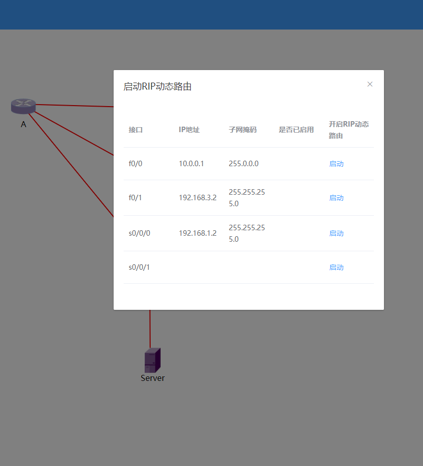

# 动态路由实验系统使用说明
## 1. 小组成员及分工
| 姓名 | 学号 | 负责工作 |
| ---- | ---- | ----|
| 黄炽丰 | MF20320067 | 组长、后端开发、前端开发、文档编写 |
| 黄冬冬 | MF20320068 | 后端开发、前端开发、文档编写 |
| 饶诗语 | MF20320115 | 实验设计、网络环境搭建、提供脚本、文档编写 |
| 骆雨颖 | MF20320102 | 实验设计、网络环境搭建、提供脚本、文档编写 |
| 李昂 | MF20320076 | 前端开发、文档编写 |
| 刘洋 | MF20320096 | 前端开发、文档编写 |

## 2. 系统操作说明
使用该系统前，用户需要按照图2.1所示的拓扑图完成网络拓扑的搭建。路由器A的s0接口连接路由器B的s0接口，路由器C的s0接口连接路由器B的s1接口，将路由器A的f0接口连接到路由器C的f0接口，将三台路由器的f1接口连接到交换机，然后使用以太网线将作为服务器的个人电脑或其他设备连接至交换机。路由器A、B、C的f1接口需要分别设置IP地址为`192.168.3.2/24`，`192.168.3.1/24`，`192.168.3.3/24`，充当服务器的设备连接到交换机的接口需要设置为与三台路由器处于同一网段。  
<div align=center><center>图2.1 网络拓扑</center></div>  

然后用户需要配置3台路由器能够使用telnet进行登录，具体需要执行的命令包括
```shell
conf t
password CISCO
login
exit
enable password CISCO
end
```
完成配置后，用户需要在充当服务器的设备上测试是否能够通过telnet的方式登录到3台路由器上，如果可以，则可以使用该系统进行动态路由配置。启动该系统的后端部分需要使用python的运行命令，在后端项目目录下运行命令`python manage.py runserver`即可启动后端部分。在前端项目目录下运行命令`npm run serve`即可启动项目的前端部分。
系统的主界面如图2.2所示，界面左侧为网络拓扑的图示。右键点击图示中的路由器图标会弹出右键菜单，如图2.3所示。使用右键菜单的选项可以对路由器进行配置或确认路由器的当前配置和路由表。
<div align=center><center>图2.2 整体界面</center></div>
<div align=center><center>图2.3 右键菜单</center></div>

点击右键菜单中的“配置接口信息”选项可以配置路由器各个接口的IP地址和子网掩码，用户在填写表单并提交后即可将设置反映到路由器上，如图2.4所示。若需要进行动态路由的配置实验，首先通过右键菜单的“配置接口信息”选项，为3台路由器的接口配置IP地址和子网掩码。将路由器A的s0接口和路由器B的s0接口配置于同一网段，将路由器B的s1接口和路由器C的s0接口配置于同一网段，将路由器A的f0接口和路由器C的f0接口配置于同一网段。此处的示例将路由器A的s0接口配置为`192.168.1.2/24`，f0接口配置为`10.0.0.1/24`；路由器B的s0接口配置为`192.168.1.1/24`，s1接口配置为`192.168.2.1/24`；路由器C的s0接口配置为`192.168.2.2/24`，f0接口配置为`10.0.0.2/24`。
<div align=center><center>图2.4 设置接口信息界面</center></div>

点击右键菜单中的“查看接口信息”选项可以查看路由器各个接口的当前IP地址和子网掩码信息，以及启动状态，如图2.5所示。配置的结果可以通过右键菜单中“查看接口信息”功能进行确认。
<div align=center><center>图2.5 查看接口信息界面</center></div>

点击右键菜单中的“开启RIP动态路由”选项可以在指定路由器上开启RIP动态路由，该界面也能够查看路由器各个接口的IP地址和子网掩码信息，用户可以选择在路由器所属的不同子网开启RIP动态路由，如图2.6所示。在前述的配置情况下，如果想要让路由器B知道到达路由器A和路由器C的f0接口所对应的地址的路由信息，则需要在每个路由器上开启RIP动态路由。
<div align=center><center>图2.6 开启RIP动态路由界面</center></div>

点击右键菜单中的“查看路由表信息”可以查看每个路由器的路由表信息。在经过上述的配置后，可以通过该功能查看每个路由器新增的路由表项，如图2.7、2.8、2.9所示。
<div align=center><center>图2.7 路由器A的路由表信息</center></div>
<div align=center><center>图2.8 路由器B的路由表信息</center></div>
<div align=center><center>图2.7 路由器C的路由表信息</center></div>  

点击主界面右上角的“控制路由器B发送数据包”按钮可以控制路由器B使用ping命令向路由器A的f0接口所在地址发送数据包，发送完成后展示数据包的到达情况信息，如图2.7所示。
<div align=center><center>图2.8 查看数据包发送情况</center></div>
